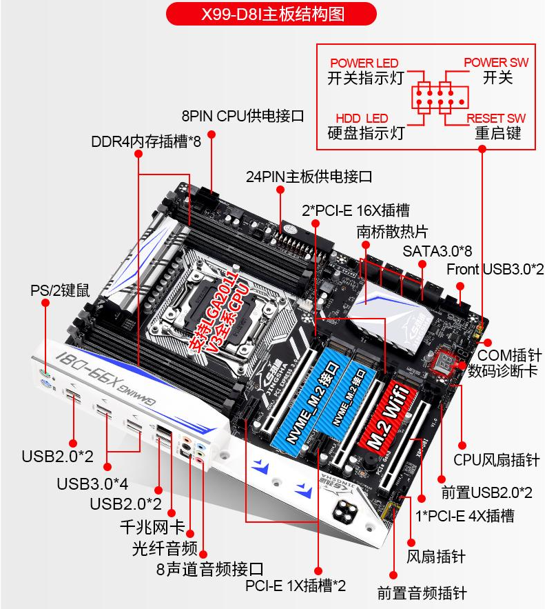

## 服务器配置介绍

现在是AI的时代，我之前的那个服务器扩展性比较差，根本没法安装显存比较大的显卡（机箱：宝藏盒Pro），所以现在打算重新换成一台扩展性好点的服务器。这样才能上手玩玩参数量大点开源的大模型，比如：[DeepSeek](https://www.deepseek.com/)，[ChatGLM4](https://github.com/THUDM/GLM-4)，[通义千问](https://github.com/QwenLM/Qwen)等等。

服务器的配置如下：

|配件|型号|功耗（W）|价格|
|-|-|-|-|
|机箱|长城阿基米德KM-7B（铁侧板）||253|
|主板|华南X99-F8主板|30|583|
|CPU|E5-2697V4(18C 36T 2.3~3.6GHz)|145|391|
|内存|ECC 32GB 2400GHz 4R x4|40|856|
|散热器|利民 PA120 SE绝双刺客（镀镍）|10|159.9|
|显卡|Tesla P40 24GB x2|500|1850|
|机械硬盘|4TB x8|120|0|
|固态硬盘|1TB x3|30|0|
|电源|长城巨龙 1250W||638|
|显卡|PCIEx1 亮机卡||61|
|配件|PCIE3.0 x16 反向延长线||38.3|
|配件|PCIE拆分卡PCIEx8 x2||98|
|配件|12厘米风扇 x4|8|59.59|
|配件|HDMI欺骗器||3|
|配件|风扇调速器||23.8|
|配件|三个显卡支撑器||16.2|
|配件|PWM风扇一分三分线器||5.68|

核心配置就是：双卡Tesla P40 24GB，E5+X99平台，总价格：5036.47元，总功耗：883W。

这样的话预算和功耗不至于太高，而且刚好可以支持到双卡P40，算是一个性价比较高的方案。之前想过搞EPYC的方案，可是光CPU和主板就4K+了，设计功耗也比E5高很多，而我的需求也不是说要做高要求的AI计算推理，或者高性能的服务器。所以还是选择了E5+X99的方案。

## 服务器软件介绍

我需要跑特别多的服务：

1. 操作系统：PVE 8.2.2，用来分配各个硬件资源和运行虚拟机，隔离NAS、AI服务、Docker容器等。
2. LXC：Debain 12，用来做一些不适合跑在PVE系统内部的东西，比如编译源码等。
3. 虚拟机：Ubuntu 22.04，用来直通显卡，跑各种AI服务。
4. Docker：用来跑各种我自己的容器，比如：Gitea、Nextcloud、FreshRSS、Syncthing等。

我这里踩了个坑，40G网卡，Linux和Windows之间的SMB启用RDMA。这个没有折腾成功。我是成功配置好KSMB了，但是网卡速度还是达不到理论上限，原因不明。所以后面又用回了samba（ksmb和samba是冲突的，不能同时使用），速度都差不多，kmsb还得额外开内核功能，多配置一些东西。当时ksmb还有个内核报错可能和Docker的虚拟网卡有关，参考：[Failed to bind socket](https://github.com/cifsd-team/ksmbd/issues/606)。我提供了些日志，但是后就没有再测试了，所以感觉还是samba稳点。服务器可不能用太多不稳地的东西，就算能折腾，那也架不住动不动就报错。

## 硬件安装过程

组装过程就是和组装家用台式机基本一样的方式。只是我把所有的PCIE插口全部用上了，而且还拆分了一个PCIEx16的改成两个x8的接口，这样就可以插一张P40和一张40G网卡。x8的PCIE3.0最高速度也有7GB往上了，应该不会降低x16的P40的速度。

这里其实有个更优的方案：拆分PCIE通道我选的是反向延长线加一个X16拆两个X8的卡，后来发现最好的方案是双公头延长线加这个拆分卡。不过我后面试了双公头线，弄坏了两根，每次都是拿到手上是好的，结果一旦插入PCIE卡槽，然后再拔出来就会有一个金手指断掉，所以后面放弃了。那个店家还是挺好说话的，我弄坏了两根，他也给退货退款。但是感觉和他的延长线也有点关系，因为反向延长线插拔多次也不会断，所以是他家的用料不够足，铜太薄了？

安装过程中也遇到了挺多的坑的，这里记录下。

### 一、劲鲨D8I主板PCIE通道存在问题

这个主板有两个问题：

1. 劲鲨D8I主板PCIE插满存在异常，怀疑是PCIE全走的CPU通道，而不是南桥低速通道，导致插满有异常或者是之前用的SCM启动模式的X1显卡。
2. 劲鲨D8I不识别PCIE4.0和PCIE3.0的固态盘混插，或者是有PCIE拆分存在问题，导致我有一块固态盘插上去后无法识别。

不是很确定是我运气不好遇到了一个坏的板子，还是说本来这块板子的PCIE走线就存在问题，导致了这两个问题
