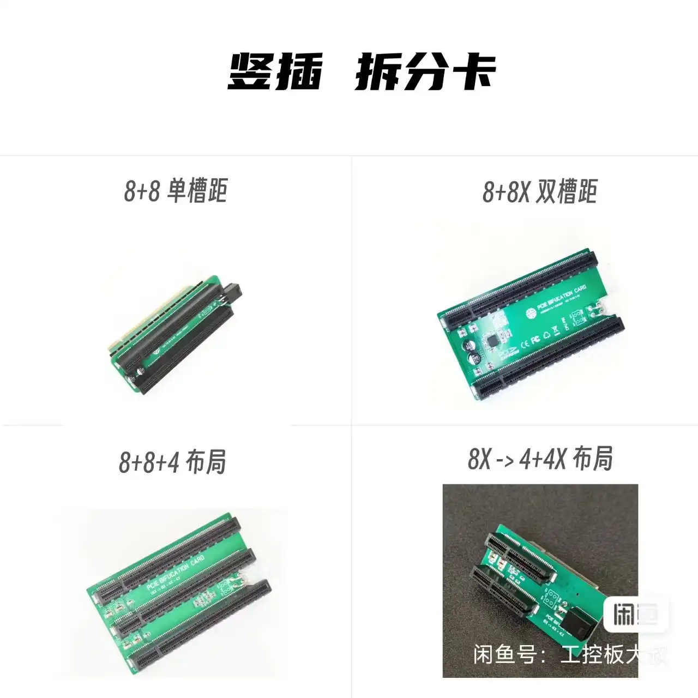
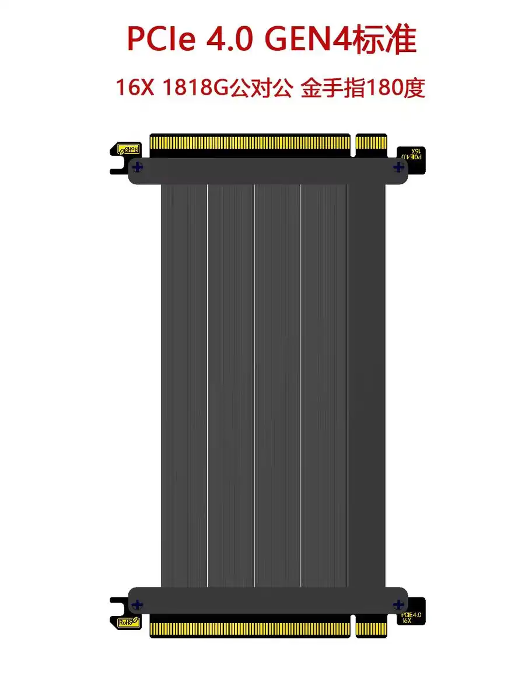
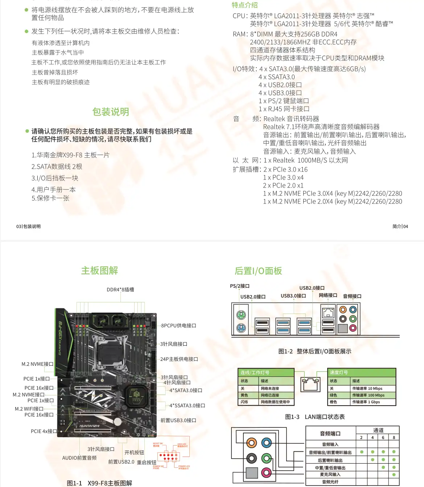
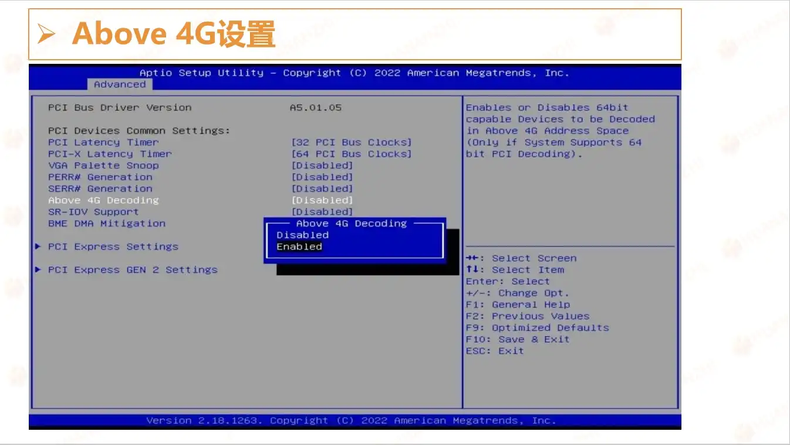
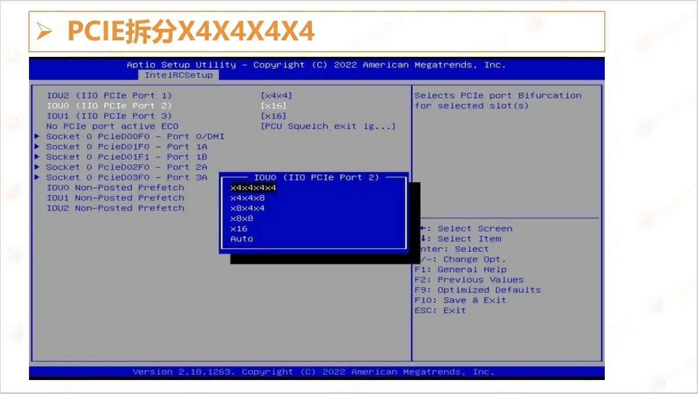
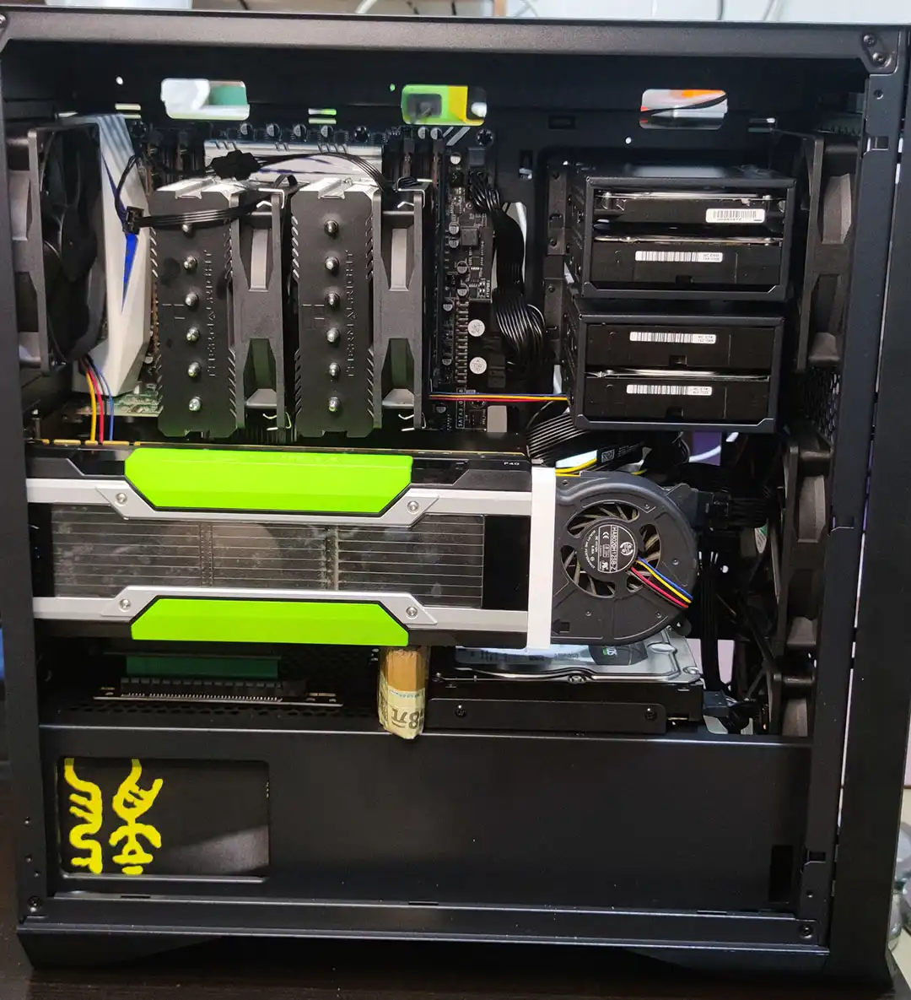
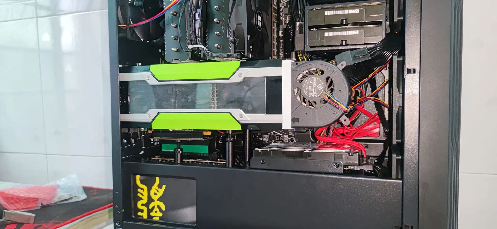
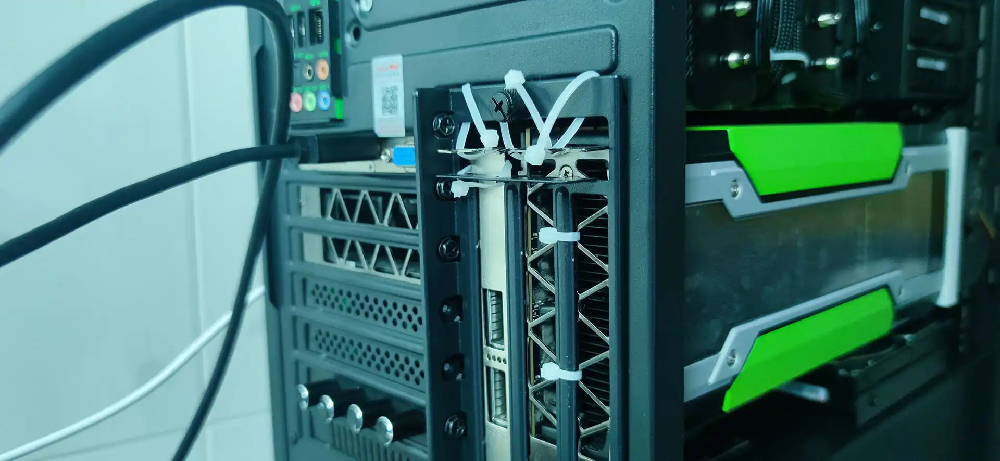
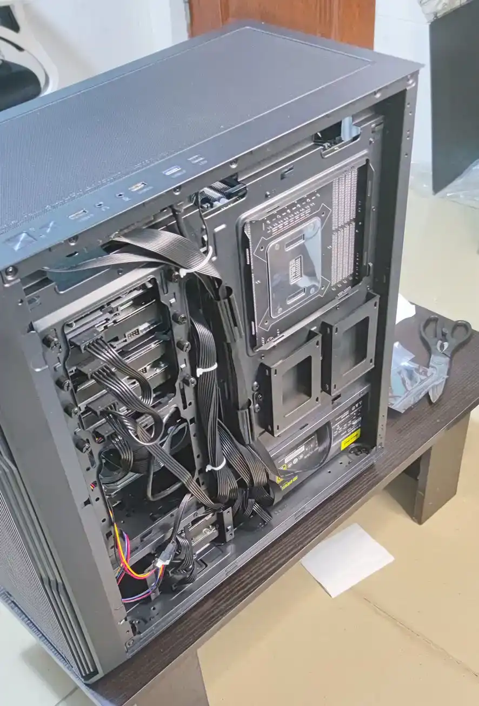

## 服务器配置介绍

现在是AI的时代，我之前的那个[老服务器](https://www.bilibili.com/video/BV1Ra4y1c7JW)扩展性比较差，根本没法安装显存比较大的显卡（机箱：宝藏盒Pro），所以现在打算重新换成一台扩展性好点的服务器。这样才能上手玩玩参数量大点开源的大模型，比如：[DeepSeek](https://www.deepseek.com/)，[ChatGLM4](https://github.com/THUDM/GLM-4)，[通义千问](https://github.com/QwenLM/Qwen)等等。

服务器的配置如下：

|配件|型号|功耗（W）|价格|
|-|-|-|-|
|机箱|长城阿基米德KM-7B（铁侧板）||253|
|主板|华南X99-F8主板|30|583|
|CPU|E5-2697V4(18C 36T 2.3~3.6GHz)|145|391|
|内存|ECC 32GB 2400GHz 4R x4|40|856|
|散热器|利民 PA120 SE绝双刺客（镀镍）|10|159.9|
|显卡|Tesla P40 24GB x2|500|1850|
|机械硬盘|4TB x8|120|0|
|固态硬盘|1TB x3|30|0|
|电源|长城巨龙 1250W||638|
|显卡|PCIEx1 亮机卡||61|
|配件|PCIE3.0 x16 反向延长线||38.3|
|配件|PCIE拆分卡PCIEx8 x2||98|
|配件|12厘米风扇 x4|8|59.59|
|配件|HDMI欺骗器||3|
|配件|风扇调速器||23.8|
|配件|三个显卡支撑器||16.2|
|配件|PWM风扇一分三分线器||5.68|

核心配置就是：双卡Tesla P40 24GB，E5+X99平台，总价格：5036.47元，总功耗：883W。硬盘都是老服务器上卸下来的，所以没有算价格。

这样的话预算和功耗不至于太高，而且刚好可以支持到双卡P40，算是一个性价比较高的方案。之前想过搞EPYC的方案，可是光CPU和主板就4K+了，设计功耗也比E5高很多，而我的需求也不是说要做高要求的AI计算推理，或者高性能的服务器。所以还是选择了E5+X99的方案。

## 服务器软件介绍

我需要跑特别多的服务：

1. 操作系统：PVE 8.2.2，用来分配各个硬件资源和运行虚拟机，隔离NAS、AI服务、Docker容器等。
2. LXC：Debain 12，用来做一些不适合跑在PVE系统内部的东西，比如编译源码等。
3. 虚拟机：Ubuntu 22.04，用来直通显卡，跑各种AI服务。
4. Docker：用来跑各种我自己的容器，比如：Gitea、Nextcloud、FreshRSS、Syncthing等。

我这里踩了个坑，40G网卡，Linux和Windows之间的SMB启用RDMA。这个没有折腾成功。我是成功配置好KSMB了，但是网卡速度还是达不到理论上限，原因不明。所以后面又用回了samba（ksmb和samba是冲突的，不能同时使用），速度都差不多，kmsb还得额外开内核功能，多配置一些东西。当时ksmb还有个内核报错可能和Docker的虚拟网卡有关，参考：[Failed to bind socket](https://github.com/cifsd-team/ksmbd/issues/606)。我提供了些日志，但是后就没有再测试了，所以感觉还是samba稳点。服务器可不能用太多不稳地的东西，就算能折腾，那也架不住动不动就报错。

## 服务器组装

组装过程就是和组装家用台式机基本一样的方式。只是我把所有的PCIE插口全部用上了，而且还拆分了一个PCIEx16的改成两个x8的接口，这样就可以插一张P40和一张40G网卡。x8的PCIE3.0最高速度也有7GB往上了，应该不会降低x16的P40的速度。

这里其实有个更优的方案：拆分PCIE通道我选的是反向延长线加一个X16拆两个X8的卡，后来发现最好的方案是双公头延长线加这个拆分卡。不过我后面试了双公头线，弄坏了两根，每次都是拿到手上是好的，结果一旦插入PCIE卡槽，然后再拔出来就会有一个金手指断掉，所以后面放弃了。那个店家还是挺好说话的，我弄坏了两根，他也给退货退款。但是感觉和他的延长线也有点关系，因为反向延长线插拔多次也不会断，所以是他家的用料不够足，铜太薄了？




安装过程中也遇到了挺多的坑的，这里记录下。

### 一、劲鲨D8I主板PCIE通道存在问题，改换华南X99-F8主板


这个主板有两个问题：

1. 劲鲨D8I主板PCIE插满存在异常，怀疑是PCIE全走的CPU通道，而不是南桥低速通道，导致插满有异常或者是之前用的SCM启动模式的X1显卡。
2. 劲鲨D8I不识别PCIE4.0和PCIE3.0的固态盘混插，或者是有PCIE拆分存在问题，导致我有一块固态盘插上去后无法识别。

不是很确定是我运气不好遇到了一个坏的板子，还是说本来这块板子的PCIE走线就存在问题，导致了这两个问题。具体原因咱就不去纠结了，不过大家买来这块板子可得自己好好测试下，不然可能后续扩展配置的时候出现问题。也是因为这两个问题，后来我就换成华南X99-F8主板了。



华南X99-F8这块板子就一点问题没有，除了一个x4的PCIE插口，其他的PCIE插口都插满了。M.2也全部用上了。总共三张固态盘，有一张还是PCIE4.0的。完全不会出现劲鲨的两个问题，写这篇文章的时候我也用了有1年的时间了，没有遇到什么问题。

### 二、BIOS配置

BIOS的配置有几点要注意下：

1. Tesla P40必须要开启Above 4G Decoding，不然会导致黑屏BIOS（注意：开启Above 4G Decoding后，会关闭CSM，导致CSM启动的显卡无法点亮，所以所有的显卡都要支持UEFI启动。）
2. 拆分PCIE通道前问下客服PCIE通道到底是BIOS中的哪个，以免拆错了。

下面两张图是从[官网文档](http://www.huananzhi.com/more.php?lm=10&id=305)截图的BIOS配置：



## 整机展示

因为最开始用了劲鲨的板子，所以下面的图片有用劲鲨主板拍的，但是我最终是用的华南X99-F8板子。





## 系统和软件安装

### 一、PVE安装

PVE的安装流程和其他系统的安装流程一样，我也没有做什么骚操作，都是联网安装，一直下一步就好。这里就推荐两个U盘启动盘制作工具：

1. [Rufus](https://rufus.ie/)：
2. [balenaEtcher](https://etcher.balena.io/)

安装好系统之后我自己有些习惯性配置，大家可以参考下：

1. 删除local-lvm卷：这个只能用来安装LXC或者虚拟机，但是我又不是主要用来跑虚拟机，所以对我来说不重要，所以删除。删除方法参考：[PVE删除Local-lvm存储空间并合并到local中](https://blog.51cto.com/wanghaoyu/5175902)。

    ``` shell
    # 删除
    lvremove pve/data
    # 合并
    lvextend -l +100%FREE -r pve/root
    # Web界面移除路径：数据中心-存储-删除local-lvm
    # sed -i '/^lvmthin: local-lvm/,/^$/d' /etc/pve/storage.cfg
    sed -i '/^lvmthin: local-lvm/,/^\s*$/d' /etc/pve/storage.cfg
    ```

2. 挂载磁盘：因为我有三个固态盘，系统占用了一个，还有两个。一个我打算用来存代码，一个用来存数据。后面我会将Docker容器的数据保存一部分到系统盘。硬盘挂载我是用Linux的方式，参考：[fstab](https://wiki.archlinuxcn.org/wiki/Fstab)

    ``` fstab
    # <file system> <mount point> <type> <options> <dump> <pass>
    ... 省略系统的配置
    # 我的代码盘
    UUID=22a0d60e-3ded-4472-b08e-98c5e7238092 /mnt/cache ext4 defaults 0 0
    # 我的数据盘
    UUID=dd2211ba-9e54-4f35-96da-74181aa0a7a2 /mnt/storage ext4 defaults 0 0
    ```

做完上面两个操作，就可以把三个硬盘当成普通硬盘来使用了。

我还会多做一个操作，安装桌面：因为我觉得桌面很方便，所以都会直接使用：`tasksel`，来安装：`Debian desktop environment`，同时这个操作也会自动创建一个新用户，后面会让LXC映射这个用户。

### 二、LXC安装

我一般还会创建一个特权LXC容器来挂载PVE的用户目录，也就是安装桌面时新建的用户的目录。这样LXC就能直接使用这个目录，用户映射参考：[External mounts inside the container](https://wiki.debian.org/LXC#External_mounts_inside_the_container)，[Unprivileged LXC containers](https://pve.proxmox.com/wiki/Unprivileged_LXC_containers)。核心配置是将ID为1000的用户映射到主机上，如下：

``` shell
# 将1000同时映射到主机和容器，将容器的root和1000都映射为主机的1000是不可行的
lxc.idmap = u 0 100000 1000
lxc.idmap = g 0 100000 1000
lxc.idmap = u 1000 1000 1
lxc.idmap = g 1000 1000 1
lxc.idmap = u 1001 101001 64535
lxc.idmap = g 1001 101001 64535
# 还需要让LXC允许映射1000这个用户
echo 'root:1000:1' | tee -a /etc/subuid /etc/subgid
```

这样做就可以用LXC操作主机的1000这个ID的用户了，我一般用这个LXC来安装编译环境，比如：`gcc`、`cmake`，这样就不会因为编译代码而污染主机环境了。

### 三、虚拟机安装

我主要有两个虚拟机：

1. AI模型虚拟机：会直通两个P40显卡，用来跑模型。安装好虚拟机后直接直通显卡，然后参考：[CUDA Toolkit](https://developer.nvidia.com/cuda-toolkit)，安装好驱动既可以快乐的跑各种模型了。
2. TrueNAS虚拟机：会直通4个机械盘，用来跑TrueNAS备份资料。安装好虚拟机后，直接直通硬盘，在PVE中写脚本将Docker数据和一些重要资料备份到TrueNAS中即可。

### 四、Docker安装

Docker我是直接安装在PVE系统中的，可能大家觉得跑在LXC或者虚拟机中会更好，这样不会对PVE造成影响。可是对于我这种轻负载场景，没有太多的虚拟机和LXC跑在PVE中，而且所有的重要数据都会每天备份到TrueNAS里，所以就直接安装在PVE中，这样也方便安装，维护。

如何安装？因为PVE是基于Debain二次开发的系统，所以直接参考Docker官网的：[Install Docker Engine on Debian](https://docs.docker.com/engine/install/debian/)安装即可。

## 结语

至此，硬件组装和PVE系统配置都已经完成了。这个文章省去了很多的细节，只是有针对性的挑出比较重要的或者需要注意的点。所以还是需要读者对Linux、PVE、Docker、LXC、虚拟机有一定的了解。
