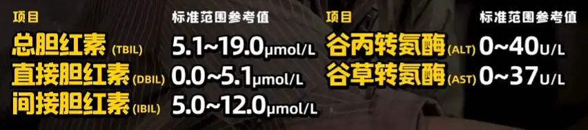
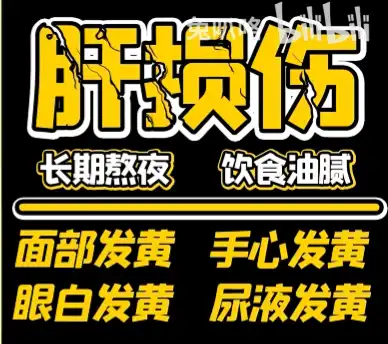
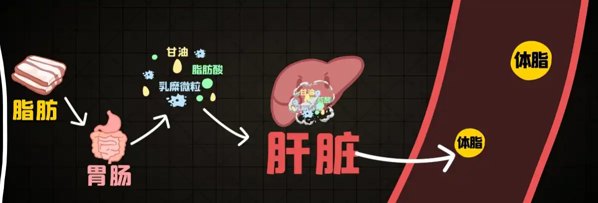
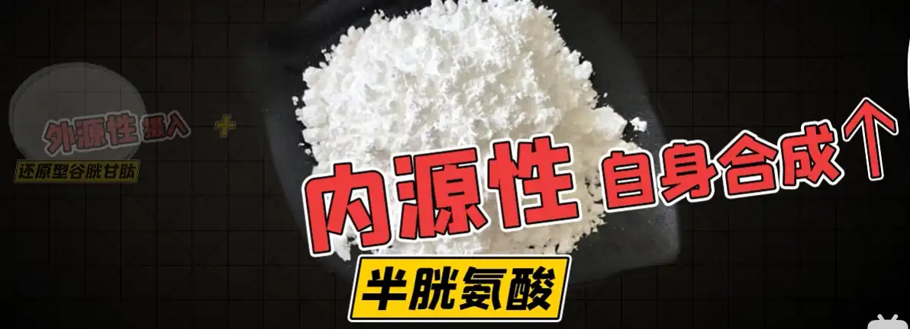
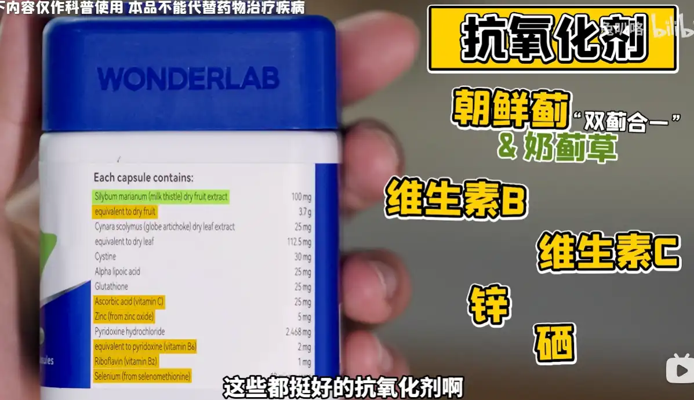
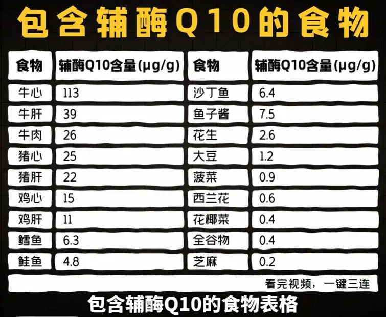

最近熬夜很多，想多了解下熬夜的危害刚好看到兔叭咯不久前更新了一个熬夜相关的视频：[【医学博士】每天凌晨3点睡，多少天会死？| 如何把熬夜危害控制到最小？](https://www.bilibili.com/video/BV1rx4y1t7XT)。看完后记录下，讽刺的是做完记录快12点了😇。不过评论区中也有说这个算是把熬夜和睡眠不足给算作一个意思了，如果每天睡得晚但是起来得也晚就可能没有这些危害了。

其实也不是一定的，我前段时间看B站主播youc“刀塔区一哥”，每天就是晚睡晚起，但是身体也不好，可能和他长期久坐有关？

提醒一下兔叭咯这期视频可能是恰饭视频，参考：[【医学博士】护肝片真的有用吗？| 出现这4种表现，说明你的肝不好！](https://www.bilibili.com/video/BV1m94y1k7Ky)，这个视频中指出护肝片只有复合型的比较推荐，就是后面要推荐的护肝片和护心片。而针对性较强的护肝片可能会导致需要其他药物配合而过量使用药物，结果就是加重身体负担反而还让身体“中毒”。

这些都是题外话了，开始记录视频内容。

# 肝
肝是一个沉默的器官：在有问题的早期是没有什么明显的症状，一发现就是晚期。不过有些“可能的症状”可以用来怀疑：

- 可能的症状：疲劳、乏力、右上腹隐痛（偶发）
- 合理怀疑点：长期熬夜饮食不规律+肚子大、四肢细=可能存在一定程度的肝损伤

医院肝功能检测参考

身体各部分发黄

## 肝的一个作用
脂肪代谢：吃进嘴里的脂肪，一部分会交给肝脏合成分解转为体脂均匀分部于全身。如果此时肝存在问题，无法很好的代谢，可能会导致脂肪在肝脏附近堆积，表现为肚子大、四肢细。

# 主要危害
睡眠剥夺通过氧化应激和炎症诱发小鼠的多器官中度损伤。睡眠剥夺增加了血清GOT、GPT 和 TBIL，提示肝损伤。 睡眠不足的小鼠肝脏细胞因子也发生了变化。
肝损伤 
- 身体各部分发黄
- 合理怀疑点：长期熬夜饮食不规律+肚子大、四肢细=可能存在一定程度的肝损伤
- 氧化应激损伤：肝脏代谢->APT&ROS->氧化应激（主要由ROS即自由基导致）->一定程度的肝损害
- 肝脏代谢性疾病：平均减寿5-10年

# 营养补剂

护肝片WanderLab Liver Detox：抗氧化，奶蓟草，谷胱甘肽，[硫辛酸](https://baike.baidu.com/item/%E7%A1%AB%E8%BE%9B%E9%85%B8)

护心片WONDERLAB CoQ10+PQQ：[辅酶Q10（CoQ10）](https://zh.wikipedia.org/wiki/%E8%BE%85%E9%85%B6Q10)，[吡咯并喹啉醌（PQQ）](https://baike.baidu.com/item/%E5%90%A1%E5%92%AF%E5%96%B9%E5%95%89%E9%86%8C/)

