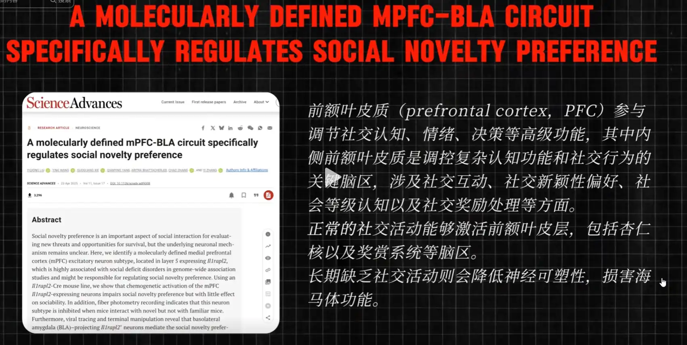
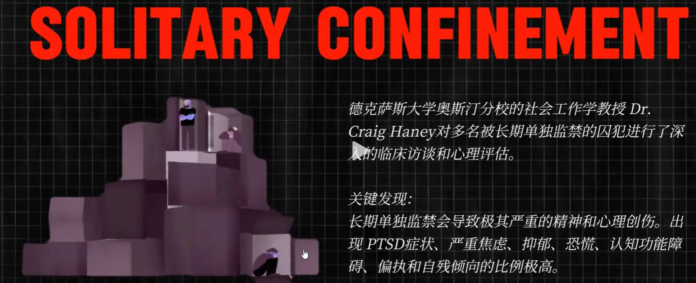

原视频：[第244集：被动独处 vs 主动独处](https://www.douyin.com/follow/search/%E5%B0%8F%E4%BA%94%E7%8B%BC?aid=e9754547-da8f-438c-8d9b-29ed2a5c74a5&modal_id=7543253088233147648&type=general)

# 核心概念

- **被迫独处**：本来想和周围的人相处，可是找不到同频的人，所以不得不自己独处。不是说他喜欢一个人自己待着，而是说他讨厌其他人。  
- **主动独处**：好好活着，做有意义的事。

---

## 被迫独处的危害

### 1. 精神层面
- 人对自己的定义有 **1/3 来自于其他人**，而被迫独处会失去这部分的自我定义。  
- 典型表现：总是问自己人生的意义，很茫然，不知道自己是谁。  
- 他人目光的维度包括：道德、职业、人生等。失去这些会让你产生 **“我对这个世界无足轻重”** 的想法。  

### 2. 对大脑的影响
参考文献：[A molecularly defined mPFC-BLA circuit specifically regulates social novelty preference](https://www.science.org/doi/10.1126/sciadv.adt9008)

- 降低神经可塑性  
- 损害海马体功能  
- 前额叶受损，会缩小  
- 注意力下降：人会显得恍惚，容易走神  

### 3. 犯人研究
- 美国 1980 年后犯人激增，聚集在一起容易闹事，因此改为单独关押。  
- 研究发现：单独关押的人患 **创伤后压力症候群（焦躁、偏执、焦虑、没有方向）** 的比例是正常犯人的 **3 倍**。  

---

## 主动独处

### 正修法门
- **正念**：关注当下，不要想过去，也不要想未来。  
- **偷偷提高**：一定要有“偷感”才能爽。如果公开给所有人知道，反而压力大，会把学习、健身变成任务，还会被人审查。  
  - 提高过程中也会产生社交活动：和作者对话，和自己对话。  
- **运动**：意念单一，更加专注；同时增强生理层面，大量分泌多巴胺、内啡肽。  

### 邪修法门
- **看剧/看番**：将意念带入另一个理想化的世界，大多遵循“邪不压正”，充满正能量，因此能治愈心灵。  
- **看网文/修仙文**：能像治疗毒瘾一样转移注意力，与其被有害因素侵蚀，不如沉浸在书中世界。  

- **不要焦虑**：  
  - 许多人在看剧获得快乐后会因为“浪费时间”而焦虑，这是错误的。  
  - 快乐本身就是人类最终追求的东西。  
  - 你应该丢弃的不是“看剧”，而是“看剧后的焦虑”。  
  - 同理，任何有正面结果的事都不必纠结副作用。  
  - 唯一例外：这种快乐若对生命造成威胁（如吸毒），就必须避免。  

---

# 名人名言

> 他人即地狱 —— 萨特  

**被动独处变成主动独处的核心**：  
要做对自己有正面影响或能带来快乐的事（前提是：不危害生命）。  
